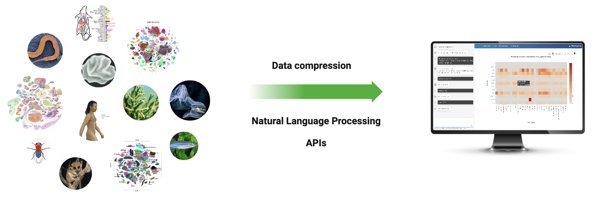
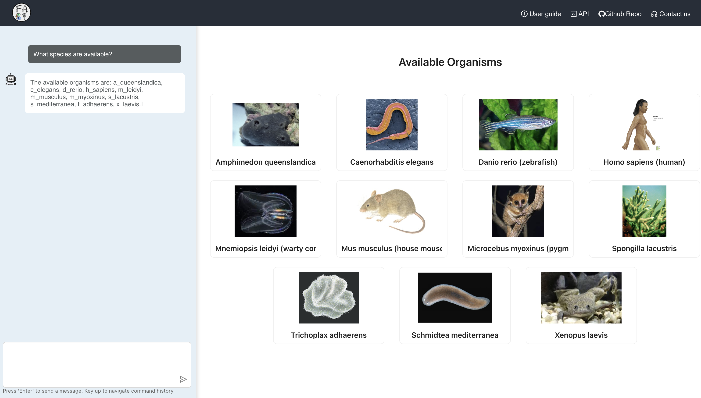
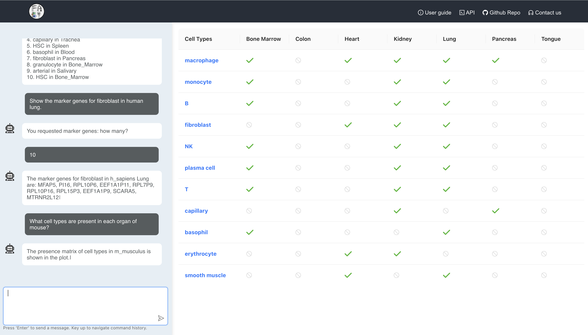
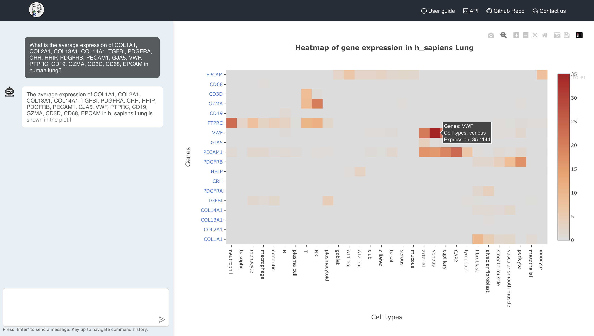
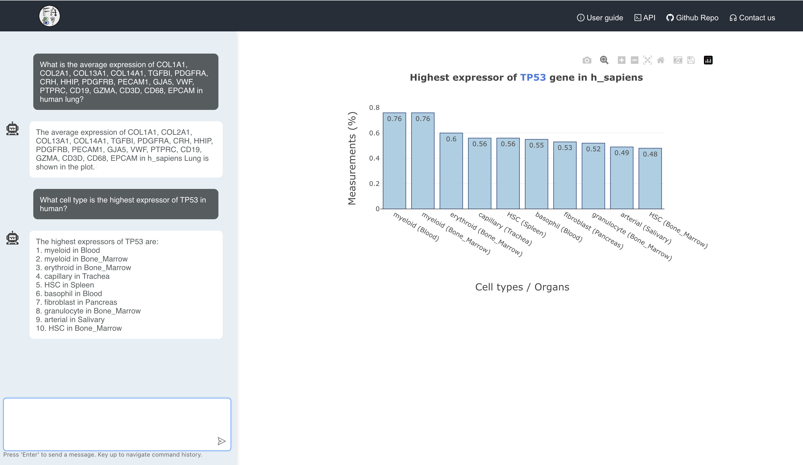
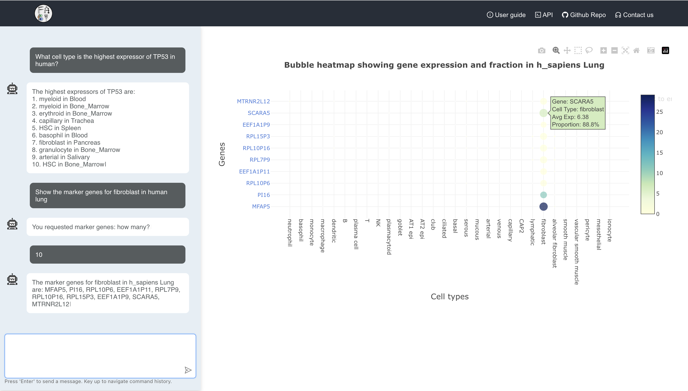

# Welcome to AtlasApprox! 

AtlasApprox is your gateway to a world of single-cell atlas data. As a dedicated platform, we curate and present a vast collection of cellular data, streamlining the exploration process for you. Here's what sets AtlasApprox apart:

### What Makes AtlasApprox Unique?

#### Diverse Organism 
DataDive deep into a range of organisms, from Drosophila melanogaster to Homo sapiens. Explore a comprehensive view of cell types and their gene expressions at your fingertips.

#### Interactive Visualizations
Our dynamic visualizations, powered by Plotly.js, allow you to seamlessly navigate through heatmaps, dot plots, bar charts, and more.

#### Intelligent Chatbot Assistance
Have a query? Interact with our AI-driven chatbot that understands and responds to your questions, guiding you through the data exploration process.

#### Zero Technical Barriers
No setups. No installations. No code. Just open your browser and start exploring the vast world of single-cell data.

Whether you're looking to compare gene expressions across different organs or want insights into specific cell types, AtlasApprox provides the tools and interface to make your exploration intuitive and insightful.

### Data Source

Our platform integrates data from various reputable sources. Below are the species and their corresponding data references:
- **Homo sapiens**: RNA - [Tabula Sapiens](https://www.science.org/doi/10.1126/science.abl4896) | ATAC - [Zhang et al. 2021](https://doi.org/10.1016/j.cell.2021.10.024)
- **Mus musculus**: [Tabula Muris Senis](https://www.nature.com/articles/s41586-020-2496-1)
- **Mus myoxinus**: [Tabula Microcebus](https://www.biorxiv.org/content/10.1101/2021.12.12.469460v2)
- **Caenorhabditis elegans**: [Cao et al. 2017](https://www.science.org/doi/10.1126/science.aam8940)
- **Danio rerio**: [Wagner et al. 2018](https://www.science.org/doi/10.1126/science.aar4362)
- **Spongilla lacustris**: [Musser et al. 2021](https://www.science.org/doi/10.1126/science.abj2949)
- **Amphimedon queenslandica**, **Mnemiopsis leidyi**, **Trichoplax adhaerens**: [Sebé-Pedrós et al 2018](https://www.nature.com/articles/s41559-018-0575-6)
- **Xenopus laevis**: [Liao et al 2022](https://www.nature.com/articles/s41467-022-31949-2#ref-CR14)
- **Schmidtea mediterranea**: [Plass et al 2018](https://www.science.org/doi/10.1126/science.aaq1723#sec-10)

### Landing page

The landing page serves as the gateway to exploring the intricate world of cell atlas approximations. With an intuitive interface, users are prompted to either input their specific queries or get inspired by clicking on pre-defined sample questions. Equipped with a friendly bot assistant, the platform ensures that all users, regardless of their expertise, find the exploration process seamless, engaging, and informative. The design of the page empowers users to dive deep into the data, fostering curiosity and facilitating discovery.

### Data exploration dashboard

Once user send their first query, the landing page will be re-arranged into a dashboard, with a split view layout featuring two main sections: a chat interface and a plot display area.

#### Chat Area
On the left side of the screen is the ChatBox. This area serves as an interactive interface for users to ask questions about cell atlas data. Users can type their queries into the text input area and press 'Enter' to send the question. The system, equipped with an intelligent bot, responds to the queries and displays the answers in this chat history area. This part of the interface keeps a history of all interactions, allowing users to review past questions and responses.

#### Plot Area
Once a user submits a question through the ChatBox, if the response includes a plot, the right side of the screen transitions to display this plot in the PlotBox area. The PlotBox area is dynamically updated to display relevant plots based on the queries and responses in the chat.

### Exploring Mouse Cell Atlas: A Use Case for Navigating Our Platform

In this section, we'll walk you through an example of how you can use our platform to explore genomics data, using the **mouse (Mus musculus)** as our model organism. The steps outlined here are applicable to other species available in our database, and we encourage you to utilize them as a guide for your personalized data exploration.

#### Cell Type Distribution

Query: "What cell types are present in each organ of the mouse?"

This query provides information about the different cell types present in each organ of the mouse.

#### Gene Expression Profile

Query: "What is the expression of TP53, AHR, MED4, VWF, COL1A1, APOE, COL2A1, COL13A1, COL14A1, TGFBI, PDGFRA, CRH, GZMA in human lung?"

This query retrieves the average expression of the a list of specified genes in the human lung.

#### Gene Presence Ratio

Query: What is the fraction of Aqp1,Slc12a1,Slc22a8,Umod,Podxl,Wt1,Pax2,Slc34a1,Nphs2,Slc12a3,Pkd1,Pkd2,Ren1,Agtr1a,Agtr2 in the mouse kidney?

This query provides the fraction of cells that express each of the specified genes in the mouse kidney.

#### Highest Expressor
Query: what cell type is the highest expressor of Apoe in mouse?

#### Marker genes

Query: "Show 10 markers of fibroblast in the mouse lung."

This query identifies 10 marker genes for the fibroblast cell type in the mouse lung.

#### Similar genes

Query: "Show 10 genes similar to Col1a1 in mouse lung."

